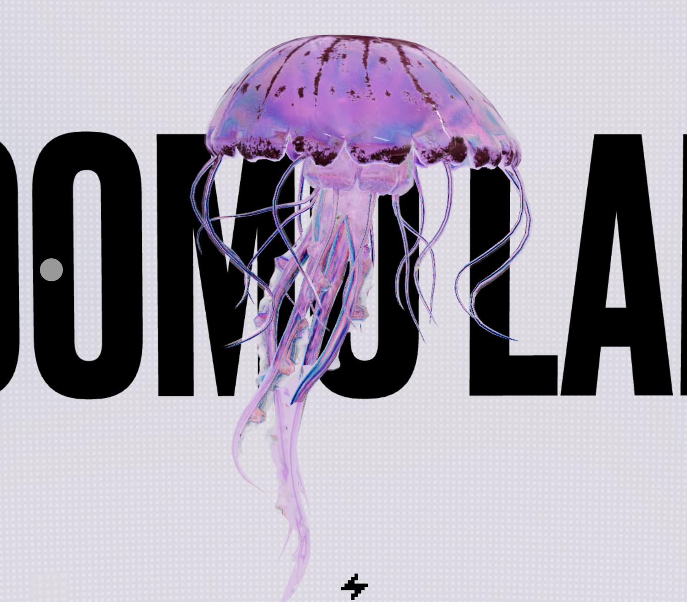
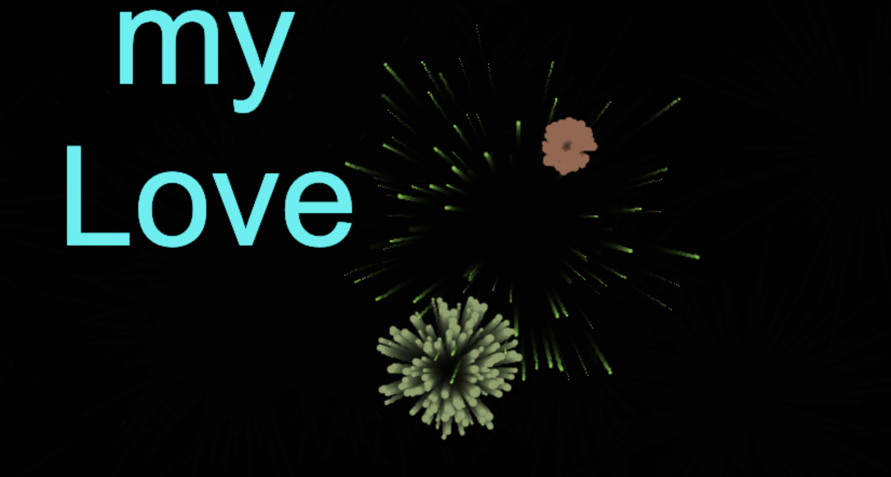

# cwan0042_9103_tutorial8
# Major project_individual task_Emotion Healing Pavilion(Cheney)

## Instructions on how to interact with the work 
### Mouse Hover
When the mouse hovers over a bubble, the bubble will exhibit a breathing effect, changing its size over time to simulate the sensation of breathing.
While hovering, the bubble will stop moving, allowing users to observe and experience the changes in the bubble.

### Mouse Click
When a bubble is clicked, it will explode and generate a particle effect, displaying a healing message related to the bubble's emotion.
Click anywhere to regenerate the bubbles and choose new emotions.

### Play/Pause Music
Users can click the "Play/Stop" button to control the playback of the background music.
Alternatively, pressing the spacebar toggles the music playback state. An event listener has been added to detect when the spacebar is pressed, playing or pausing the background music accordingly.

## Details of individual approach to animating the group code.
### I choose interaction to drive my individual code.

### Animated Properties
1. Hover Effect：
When a bubble is hovered over with the mouse, it triggers a breathing effect, changing the bubble's size over time (modifying this.phase and this.size).

2. Breathing Effect：
When a bubble is hovered over, this.size changes with sin(this.phase), making the bubble appear to be breathing.

3. Explosion Effect：
When a bubble explodes, it generates particles that spread from the bubble's this.x and this.y position and gradually disappear (decrementing this.alpha).

4. Text Display：
Removed the breathing and ripple effects of the text, opting instead for a simple rendering of the text.

5. Music Control：
Added an event listener that detects when the spacebar is pressed, calling the play_pause function to toggle the music playback state.

### References of inspiration 
1. Inspiration for the Breathing Effect：

https://labs.noomoagency.com/?utm_source=extension&utm_medium=click&utm_campaign=muzli

2. Inspiration for exploration and text：

https://openprocessing.org/sketch/2154511

### Technical explanation
1. Mouse Hover：
Initialization: this.isHovered is initialized to false in the MovingBubble constructor.
Mouse Hover Detection: In the draw function, bubble.isHovered is set based on the distance between the mouse pointer and the bubble's center.
Size Change: If isHovered is true, this.phase is incremented and this.size is adjusted using sin(this.phase), creating a breathing effect.

Code source：
（https://p5js.org/reference/#/p5/dist）
（https://p5js.org/reference/#/p5/sin）

2. Exploration：
Initialization: this.isExploding is initialized to false in the MovingBubble constructor.
Explosion Logic: In the explode method, this.isExploding is set to true, and 100 new Particle instances are created, with the initial position set to the bubble's current position and the color set to this.col1.
Particle Movement: The move method in the Particle class updates the particle's position and gradually decreases this.alpha, simulating the fading effect of the particles.

Code source：
The implementation of the explosion effect and particle generation, including the creation of particles upon bubble explosion and their movement logic, was inspired by ChatGPT's recommendations (OpenAI, 2024).

3. Text Display：
Global Variables: Added displayMessage, displayMessageColor, displayMessageAlpha, and isMessageDisplayed to control the display of text after the explosion.
Mouse Click Handling: In the mousePressed function, when a bubble is clicked, the explode method is called and the corresponding healing message is displayed.
Message Display: In the draw function, if displayMessage has a value, the healing message is rendered, and displayMessageAlpha is gradually increased to create a fade-in effect.

Code source：
（https://p5js.org/reference/#/p5/lerpColor）
（https://p5js.org/reference/#/p5/color）
（https://p5js.org/reference/#/p5/text）
 (https://p5js.org/reference/#/p5/textSize)

4. Music Control：
Event Listener: In the setup function, an event listener is added to detect when the spacebar is pressed. When the spacebar is pressed, the play_pause function is called to toggle the music playback state.
Music Playback Control: The play_pause function checks if song is playing; if it is, it stops the playback, and if it is not, it starts looping the music.

Code source:
(https://developer.mozilla.org/en-US/docs/Web/API/EventTarget/addEventListener)
(https://p5js.org/reference/#/libraries/p5.sound)

